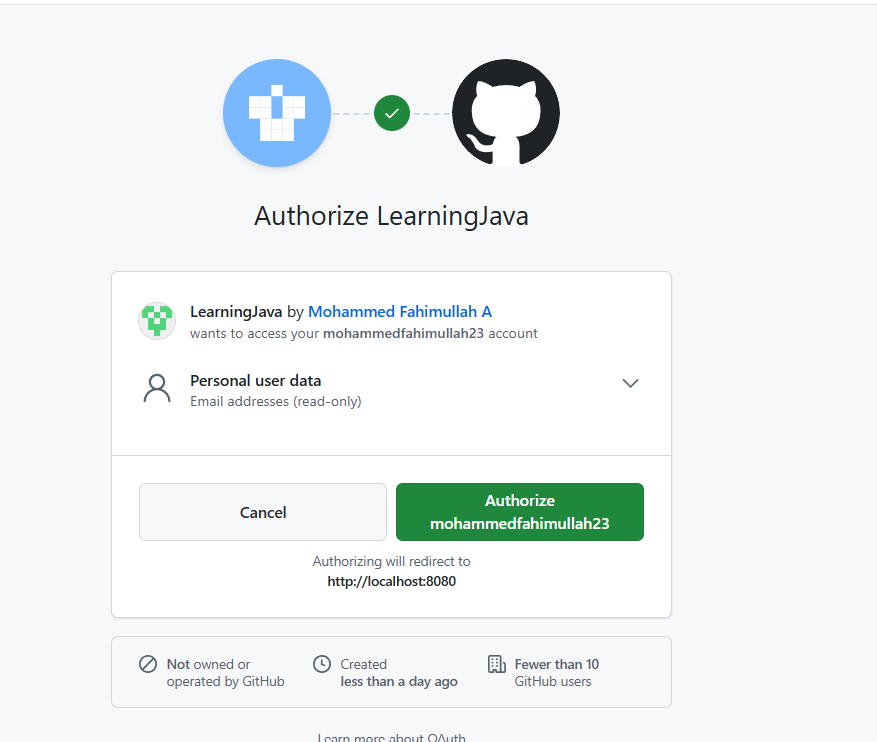

### Adding OAuth to the application

First to support this we need to add the dependency

```
<dependency>
    <groupId>org.springframework.boot</groupId>
    <artifactId>spring-boot-starter-oauth2-client</artifactId>
    <version>4.0.1</version>
</dependency>
```

I am adding github.So you need to create clientId and clientSecret in the github under OAuth Settings 
under developer settings. Add this in your application.yml file/

You need to set github developer settings
http://localhost:8080/login/oauth2/code/github in callback url.
It is the OAuth callback endpoint that Spring Security automatically provides for GitHub login.


To test this in local using postman
http://localhost:8080/oauth2/authorization/github

This opens the authorize option.you authorize them. After the successful authorization its goes to the  OAuthSuccessHandler



OAuthSuccessHandler is where you can write custom logic where you can add the data in the DB.

I was facing an issue, by default the email is not given by the github. Even if I explicity asked in the scope to solve this issue, we need to call https://api.github.com/user/emails and get the email from this. To sovle this issue we need to write this service CustomOAuth2UserService and update the logic in SecurityConfig file.

```
    .oauth2Login(oauth -> oauth
     .userInfoEndpoint(userInfo ->
        userInfo.userService(customOAuth2UserService)
      )
    .successHandler(oAuthSuccessHandler)
                )
```

### Flow
The OAuth login flow starts when the client hits /oauth2/authorization/github, which tells Spring Security to initiate login and redirect the browser to GitHub with the client ID, requested scopes, a generated state, and the redirect URI; the user then logs in on GitHub and approves access, after which GitHub redirects the browser back to /login/oauth2/code/github with a short-lived, one-time authorization code and the same state, Spring Security validates the state to prevent CSRF, exchanges the code with GitHub server-to-server for an access token, uses that token to call GitHub’s user-info API to fetch the authenticated user’s details, passes those details to customOAuth2UserService, and finally invokes OAuthSuccessHandler, where your application typically creates its own JWT and returns or stores it so that all subsequent API requests are authenticated using JWT rather than OAuth.

Frontend (localhost:3000)
   ↓
GET http://localhost:8080/oauth2/authorization/github
   ↓
GitHub Login Page
   ↓
GitHub → /login/oauth2/code/github   (BACKEND)
   ↓
Spring Security
   ↓
OAuthSuccessHandler
   ↓
Redirect → http://localhost:3000/oauth-success


The redirect to /login/oauth2/code/github is a mandatory part of the OAuth authorization-code flow and has nothing to do with whether you fetch extra user information like email or not; GitHub must always redirect the browser to this callback with a one-time authorization code so Spring Security can securely exchange it for an access token on the backend, and that exchange must happen before anything else—only after the token is obtained can Spring Security optionally call the user-info API, and even if you completely skip fetching the email or any additional profile data, the flow still goes through /login/oauth2/code/github, validates the state, exchanges the code for a token, and then invokes your customOAuth2UserService and OAuthSuccessHandler, where you can simply read the username and ignore all other fields.

After a successful login on GitHub, the browser is redirected to /login/oauth2/code/github with two parameters: code and state. The code does not contain the scopes or any readable data; instead, it is an opaque, short-lived, one-time authorization code that represents the user’s approval (including the approved scopes) on GitHub’s side. The state is a randomly generated value created by Spring Security and stored before the redirect, and when GitHub sends it back unchanged, Spring Security compares the returned state with the stored one to ensure the response belongs to the original login request and to protect against CSRF. If the state matches, Spring Security then uses the code in a secure server-to-server call to GitHub to obtain an access token that actually carries the scopes and permissions, and the OAuth flow continues.

Yes, the user first logs in on GitHub, and then GitHub redirects back to your backend callback /login/oauth2/code/github with a code and state; Spring Security first checks the state value to protect against CSRF attacks, and only if the state is valid does it then make a server-to-server call to GitHub using that code (along with the client ID and client secret) to obtain the access token, which actually contains the approved scopes and permissions—this token exchange happens after the callback, not before, and once the access token is received, Spring Security continues the flow by loading user details and calling your OAuthSuccessHandler.

Login → callback with code & state → state validation → server-to-server token exchange → success handler